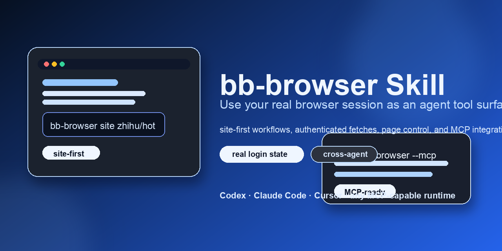

# bb-browser Skill for AI Agents



Turn your real Chrome session into an agent tool surface.

This repository packages a reusable cross-agent skill for [bb-browser](https://github.com/epiral/bb-browser): a CLI + MCP bridge that lets Codex, Claude Code, Cursor, and similar agents reuse your real browser login state for `site` queries, authenticated fetches, page interaction, and Chrome-backed debugging.

## Hero examples

```bash
# query a real site adapter first
bb-browser site zhihu/hot

# bootstrap a real browser tab and read from it
bb-browser tab new "https://example.com" --json
bb-browser wait 1500 --tab <tab> --json
bb-browser get title --tab <tab> --json

# expose bb-browser to an agent runtime
npx -y bb-browser --mcp
```

## Why people star this

- Real browser login state, not a throwaway automation profile
- `site`-first workflow that often beats click-heavy browser automation
- Works as both a human CLI and an MCP bridge for agent runtimes
- Documents the real quirks of current `bb-browser` behavior instead of hiding them

## Preview


- **Site-first**: start with `bb-browser site ...` when an adapter already exists
- **Real browser state**: reuse the user's actual logged-in browser instead of booting a fake automation profile
- **MCP-ready**: expose the same workflow to Codex, Claude Code, Cursor, and other MCP-capable runtimes

## Why this exists

Most browser automation stacks start from a clean browser profile. That is great for testing, but awkward for agent work on real websites.

`bb-browser` takes a different path:

- It reuses your real browser login state
- It prefers `site` commands when a site adapter already exists
- It can still drop down to `open`, `snapshot`, `click`, `fetch`, and `network`
- It can be exposed to agents through `--mcp`

This skill turns those capabilities into a repeatable workflow for agent users.

## Who this is for

- Codex users who want a local skill for `bb-browser`
- Claude Code and Cursor users who want a portable skill-style guide
- Agent builders who need authenticated browser access without reinventing a Playwright stack

## Why not Playwright?

Playwright is excellent for deterministic testing and isolated automation. This skill is for a different job:

- Playwright starts from an isolated browser unless you explicitly manage profiles
- `bb-browser` is optimized for your existing browser identity
- Playwright is test-first
- `bb-browser` is operator-first and agent-first
- With `bb-browser`, the first question is: "does a `site` adapter already solve this?"

If your goal is UI testing, use Playwright. If your goal is letting an agent work through your real browser session, use `bb-browser`.

## What you get

| Need | Recommended path |
|---|---|
| Structured data from supported sites | `bb-browser site ...` |
| Real logged-in page inspection | `tab new` -> `wait` -> `snapshot/get` |
| Authenticated network introspection | `fetch` / `network` |
| Agent integration | `bb-browser --mcp` |

## Install

### 1. Install `bb-browser`

```bash
npm install -g bb-browser
```

### 2. Install this repository into your agent setup

| Runtime | Recommended setup | What to do |
|---|---|---|
| Codex | Local skill + optional MCP | Copy this repo to `~/.codex/skills/bb-browser`, then use the skill directly. |
| Claude Code | MCP-first + repo as reference | Use `bb-browser --mcp` in your MCP config, and keep this repo for workflow docs. |
| Cursor | MCP-first + repo as reference | Add `bb-browser --mcp` to Cursor MCP settings, and use this repo for prompts and operator guidance. |

### 3. Codex setup

```bash
mkdir -p "$HOME/.codex/skills"
cp -R bb-browser-skill "$HOME/.codex/skills/bb-browser"
```

The skill name is `bb-browser`, so the target directory should end up as:

```text
~/.codex/skills/bb-browser
```

### 4. Claude Code setup

Add `bb-browser` as an MCP server:

```json
{
  "mcpServers": {
    "bb-browser": {
      "command": "npx",
      "args": ["-y", "bb-browser", "--mcp"]
    }
  }
}
```

Use this repository as the skill-style operating guide for:

- `site`-first workflows
- tab bootstrap and page reads
- troubleshooting current `bb-browser` quirks

### 5. Cursor setup

Use the same MCP server entry in Cursor's MCP configuration:

```json
{
  "mcpServers": {
    "bb-browser": {
      "command": "npx",
      "args": ["-y", "bb-browser", "--mcp"]
    }
  }
}
```

Then keep this repository nearby as the operator guide for command selection and troubleshooting.

### 6. Reusing this repository in other runtimes

For Claude Code, Cursor, or other agent setups, you can reuse the same repository structure:

- `SKILL.md` is the main workflow file
- `references/` contains deeper guidance
- `agents/openai.yaml` carries UI-facing metadata for compatible runtimes

## Quick verification

Run these commands before using the skill with an agent:

```bash
command -v bb-browser
bb-browser --version
bb-browser daemon status --json
```

If you are starting from a clean managed browser state and `open` fails with `No page target found`, bootstrap a page target once:

```bash
bb-browser tab new "https://example.com" --json
```

Then verify one `site` workflow and one browser-control workflow:

```bash
bb-browser site wikipedia/summary "Python (programming language)" --json
bb-browser tab new "https://example.com" --json
bb-browser wait 1500 --tab <tab> --json
bb-browser get title --tab <tab> --json
```

`<tab>` is the short tab id returned in the `tab` field from `tab new`.

## Three core examples

### 1. Site query first

```bash
bb-browser site zhihu/hot
bb-browser site github/search "model context protocol"
bb-browser site wikipedia/summary "Python (programming language)" --json
```

Use `site` whenever an adapter already exists. It is usually faster, cleaner, and more stable than manual page interaction.

### 2. Open, snapshot, get

```bash
bb-browser tab new "https://example.com" --json
bb-browser wait 1500 --tab <tab> --json
bb-browser snapshot -i --tab <tab>
bb-browser get title --tab <tab>
```

When there is no suitable `site` adapter:

1. create or identify a tab target
2. wait briefly for the page to load
3. `snapshot` to obtain fresh refs
4. interact with refs or read values with `get`

Use `open` when you already have a stable target tab and want to navigate it, for example in a simple single-tab flow.

### 3. MCP integration

Use `bb-browser` as an MCP server for compatible agent tools:

```json
{
  "mcpServers": {
    "bb-browser": {
      "command": "npx",
      "args": ["-y", "bb-browser", "--mcp"]
    }
  }
}
```

More platform-specific examples live in [references/mcp-integration.md](./references/mcp-integration.md).

## What this skill covers

- `bb-browser` installation checks
- daemon and browser readiness checks
- `site`-first command routing
- manual page workflows with `open`, `snapshot`, `click`, `fill`, `fetch`, and `network`
- MCP integration for Codex, Claude Code, and Cursor
- common troubleshooting for CDP, daemon, and stale refs

## What this skill does not cover

- writing new `site` adapters
- replacing Playwright as a test framework
- full browser testing strategy
- release automation or publishing pipelines

## Safety model

`bb-browser` can act through your real browser session. Treat it as a high-trust tool.

Recommended default:

- allow read-only lookups freely
- pause before actions with real side effects
- require explicit confirmation for:
  - posting
  - messaging
  - ordering
  - account settings changes
  - admin actions

## Repository structure

```text
bb-browser-skill/
├── README.md
├── SKILL.md
├── LICENSE
├── .gitignore
├── agents/
│   └── openai.yaml
├── assets/
│   ├── bb-browser-small.svg
│   └── bb-browser.svg
│   ├── social-preview.svg
│   └── social-preview.png
├── examples/
│   └── prompts.md
└── references/
    ├── cli-workflows.md
    ├── mcp-integration.md
    └── troubleshooting.md
```

## Example prompts

See [examples/prompts.md](./examples/prompts.md) for reusable prompts and use cases.

## Roadmap

- Add a public installation guide for non-Codex runtimes
- Add adapter-selection heuristics for common site classes
- Add a companion skill for adapter authoring
- Add richer real-world examples from research and operations workflows

## License

[MIT](./LICENSE)
