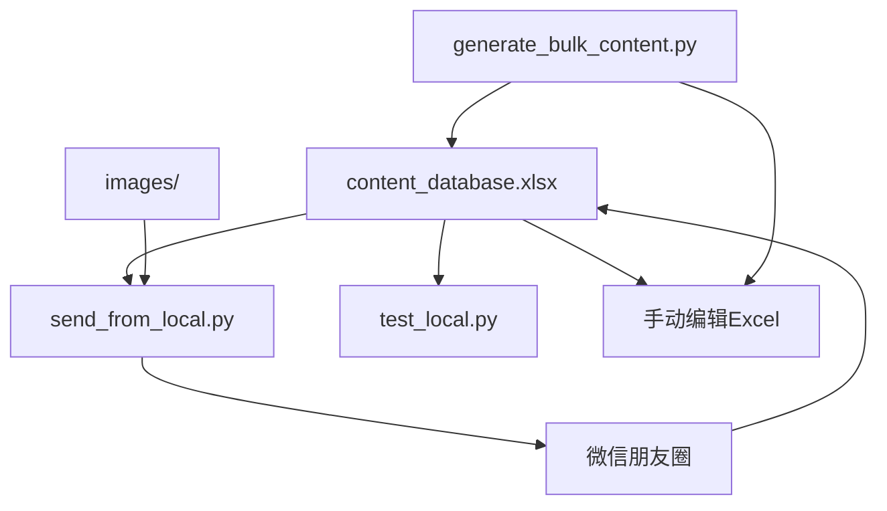

# 文件夹结构说明

## 总体结构

```
wechat-moments-auto/
├── content_database.xlsx     # Excel内容数据库（文档文件夹）
├── images/                   # 博主图片目录（图片文件夹）
├── random-images/            # 随机图片目录
├── ui_images/                # 界面元素截图目录
├── scripts/                  # Python脚本目录
├── README.md                 # 主文档（包含本地版本说明）
├── README_local.md          # 本地版本完整文档
├── LOCAL_GUIDE.md           # 本地版本使用指南
├── FOLDER_STRUCTURE.md      # 文件夹结构说明
├── INDEX.md                  # 文档索引
├── QUICK_START.md           # 快速开始指南
├── SCRIPTS_GUIDE.md         # 脚本详细说明
├── SUMMARY.md               # 使用总结和验证报告
├── CHECKLIST.md             # 功能检查清单
```

## 核心文件夹

### 1. 文档文件夹（Excel数据库）

`content_database.xlsx` 是整个系统的核心文档数据库，相当于本地版的"多维表格"。

**功能特点：**
- 存储所有待发布内容
- 支持批量生成（上百条内容）
- 自动状态管理（未发布/已发布）
- 记录发布时间
- 支持手动编辑和扩展

**Excel字段说明：**
- `ID`: 唯一标识符
- `博主`: 博主名称（用于匹配图片）
- `内容`: 朋友圈文案内容
- `图片路径`: 对应博主图片路径
- `状态`: 未发布/已发布（自动更新）
- `创建时间`: 内容创建时间
- `发布时间`: 实际发布时间（自动填写）
- `备注`: 备注信息

### 2. 图片文件夹

`images/` 目录存放博主头像图片，是图片文件夹的核心。

**图片文件要求：**
- 文件名必须与博主名称匹配
- 支持PNG、JPG格式
- 图片大小建议：200x200像素以上

**当前博主图片：**
- `路飞.png`: 路飞博主头像
- `大元.png`: 大元博主头像
- `全哥.png`: 全哥博主头像

**添加新博主步骤：**
1. 将博主头像图片放入 `images/` 目录
2. 文件名格式：`博主名称.png`
3. 在Excel中添加对应博主的内容

### 3. 脚本文件夹

`scripts/` 目录包含所有Python脚本。

**核心脚本：**
- `run_local.py`: 本地版本入口脚本
- `send_from_local.py`: 本地Excel发送核心模块
- `generate_bulk_content.py`: 批量内容生成脚本
- `send_by_image.py`: 图像识别发送模块
- `wechat_utils.py`: 微信窗口管理工具

**批量生成脚本：**
- `generate_bulk_content.py`: 生成大量朋友圈内容
- 支持指定博主、自定义内容
- 可以添加到现有Excel或生成新Excel

### 4. 界面截图文件夹

`ui_images/` 目录存放微信界面截图，用于图像识别。

**截图文件：**
- `moments_icon.png`: 朋友圈图标
- `camera_btn.png`: 相机按钮
- `publish_btn.png`: 发表按钮

**截图更新：**
如果微信界面变化，需要重新截图：
```bash
python run.py capture
```

### 5. 随机图片文件夹

`random-images/` 目录存放随机图片，用于没有博主图片时的备用图片。

## 工作流程

### 本地Excel版本工作流程

1. **准备阶段**
   - 准备博主头像图片到 `images/` 目录
   - 使用 `generate_bulk_content.py` 生成Excel数据库

2. **日常使用**
   - 运行 `run_local.py local` 发送内容
   - Excel状态自动更新为"已发布"
   - 发布时间自动记录

3. **扩展维护**
   - 手动编辑Excel添加新内容
   - 定期运行 `generate_bulk_content.py --add` 添加批量内容
   - 添加新博主图片到 `images/` 目录

### Notion版本工作流程

1. **准备阶段**
   - 准备博主头像图片到 `images/` 目录
   - 配置Notion API Token和数据库ID

2. **日常使用**
   - 运行 `run.py notion` 发送内容
   - Notion状态自动更新为"完成"

## 文件关系图



## 部署建议

### 单机部署
- 所有文件放在同一台电脑
- Excel数据库和图片文件夹在同一目录
- 使用Windows任务计划程序定时运行

### 多机部署
- Excel数据库可以共享
- 图片文件夹需要同步
- 脚本文件夹可以复制到多台电脑

### 备份策略
- 定期备份 `content_database.xlsx`
- 备份 `images/` 目录
- 备份脚本文件夹

## 注意事项

1. **Excel文件权限**：确保脚本可以读写Excel文件
2. **图片文件匹配**：博主名称必须与图片文件名匹配
3. **微信窗口准备**：确保微信已启动并登录
4. **定时任务配置**：Windows任务计划程序需要正确配置路径
5. **Python依赖**：确保安装了所有必要的Python包